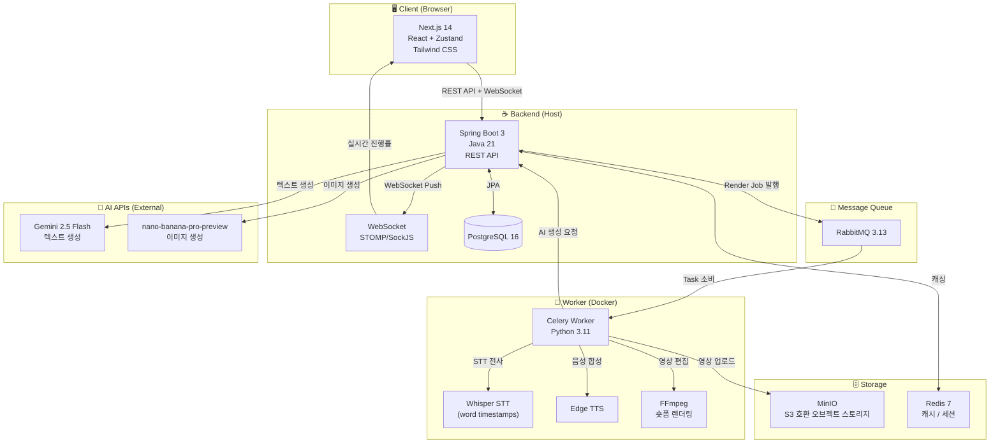

<div align="center">

# 🎬 Community Short-Form

**커뮤니티 글 · 유튜브 영상을 AI가 자동으로 숏폼으로 변환해주는 풀스택 서비스**

[](https://openjdk.org/)
[](https://spring.io/projects/spring-boot)
[](https://nextjs.org/)
[](https://www.python.org/)
[](https://www.docker.com/)

<!--
  💡 [권장] 시연 GIF 또는 영상 삽입 방법:
  
  1. 화면 녹화 도구(ScreenToGif, OBS, QuickTime)로 앱 동작을 녹화
  2. GIF: GitHub 이슈(New Issue) 창에 드래그 → 업로드된 URL 복사 후 아래에 붙여넣기
     영상: YouTube/Loom으로 업로드 후 아래 이미지 클릭 링크로 연결
  3. 권장 해상도: 1280×720, 최대 10MB (GIF 기준)

  예시:
  
  
  또는 YouTube 썸네일로 클릭 가능한 링크:
  [](https://www.youtube.com/watch?v=YOUR_VIDEO_ID)
-->

</div>

---

## 📌 프로젝트 소개

Reddit · 유튜브 URL 또는 주제를 입력하면 **AI가 자동으로 스크립트를 생성하고, 이미지를 그리고, TTS 음성과 자막을 합성해 숏폼 영상(9:16)을 완성**해주는 서비스입니다.

- 기획부터 영상 출력까지 **원클릭 자동화 파이프라인** 구현
- **Gemini 2.5 Flash** 텍스트 생성 + **nano-banana-pro-preview** 이미지 생성
- **Whisper** 음성 재전사로 자막 싱크 정밀 보정
- **WebSocket** 실시간 진행률 스트리밍

---

## ✨ 핵심 기능

| 기능 | 설명 |
|------|------|
| 🕷️ **자동 크롤링** | Reddit · YouTube URL → 제목·본문·댓글 자동 파싱 |
| ✍️ **AI 스크립트 생성** | Gemini 2.5 Flash로 장면별 나레이션 + 이미지 프롬프트 생성 |
| 🖼️ **AI 이미지 생성** | nano-banana-pro-preview (Gemini)로 장면별 9:16 세로형 이미지 생성 |
| 🎙️ **TTS + 자막 싱크** | Edge TTS 음성 합성 → Whisper word-level 재전사 → 프레임 정밀 정렬 |
| 🎬 **FFmpeg 자동 편집** | 이미지·음성·자막·BGM을 조합, 숏폼 포맷으로 자동 렌더링 |
| 📡 **실시간 진행 알림** | WebSocket(STOMP/SockJS)으로 단계별 진행률 UI 실시간 반영 |
| ☁️ **영상 스토리지** | MinIO(S3 호환)로 결과물 저장 및 48시간 Presigned URL 제공 |

---

## 🗂️ 시스템 아키텍처

<!--
  💡 아키텍처 다이어그램 삽입 방법 (3가지 옵션):

  [옵션 A] Mermaid (GitHub에서 바로 렌더링됨 — 가장 간단) ← 아래에 이미 포함
  [옵션 B] draw.io: https://app.diagrams.net → PNG 내보내기 → GitHub에 업로드
           
  [옵션 C] Excalidraw: https://excalidraw.com → SVG/PNG 내보내기 → 동일하게 업로드
-->



### 렌더링 파이프라인 흐름

```
URL/주제 입력
    │
    ▼
[1] 크롤링 & 파싱 (Reddit / YouTube / 직접 주제)
    │
    ▼
[2] Gemini 2.5 Flash → 장면별 스크립트 생성
    │
    ▼
[3] nano-banana-pro-preview → 장면별 9:16 이미지 생성 (병렬)
    │
    ▼ PARSED 상태 (프리뷰 확인 가능)
    │
[4] 렌더 버튼 → RabbitMQ에 Job 발행
    │
    ▼
[5] Celery Worker
    ├─ Edge TTS 음성 합성
    ├─ Whisper word-level 재전사 (자막 싱크 보정)
    ├─ Jua 폰트 디즈니풍 ASS 자막 생성
    └─ FFmpeg 최종 편집 (이미지 + 음성 + 자막 + BGM)
    │
    ▼
[6] MinIO 업로드 → Presigned URL 반환
    │
    ▼ COMPLETED (다운로드 가능)
```

---

## 🛠️ 기술 스택

| 분류 | 기술 |
|------|------|
| **Backend** | Java 21, Spring Boot 3, Spring Data JPA, Spring WebSocket (STOMP) |
| **Frontend** | Next.js 14, TypeScript, Tailwind CSS, Zustand, Framer Motion |
| **Worker** | Python 3.11, Celery, FFmpeg, OpenAI Whisper, Edge TTS, MoviePy |
| **AI** | Google Gemini 2.5 Flash (텍스트), nano-banana-pro-preview (이미지) |
| **Database** | PostgreSQL 16, Redis 7 |
| **Message Queue** | RabbitMQ 3.13 |
| **Storage** | MinIO (S3 호환), Presigned URL |
| **Infra** | Docker Compose, GitHub Actions (예정) |

---

## 🚀 빠른 시작

### 사전 요구사항

- Java 21+
- Node.js 20+
- Docker Desktop

### 1. 저장소 클론

```bash
git clone https://github.com/chuuro/community-short-form.git
cd community-short-form
```

### 2. 환경 변수 설정

```bash
cp backend/.env.example backend/.env
```

`backend/.env` 에 아래 값을 입력합니다:

```env
GEMINI_API_KEY=your_gemini_api_key
```

> 선택 사항: `OPENAI_API_KEY`, `NEWS_API_KEY`, `PEXELS_API_KEY`, `REDDIT_CLIENT_ID` 등

### 3. 인프라 실행 (Docker)

```bash
docker compose up -d
```

다음 서비스가 시작됩니다:

| 서비스 | 주소 |
|--------|------|
| PostgreSQL | `localhost:5432` |
| Redis | `localhost:16379` |
| RabbitMQ Management | `http://localhost:15672` (guest/guest) |
| MinIO Console | `http://localhost:9001` (minioadmin/minioadmin123) |
| Celery Worker | Docker 컨테이너 내 실행 |

### 4. 백엔드 실행

```bash
cd backend
./mvnw spring-boot:run
# 또는
mvn spring-boot:run
```

### 5. 프론트엔드 실행

```bash
cd frontend
npm install
npm run dev
```

브라우저에서 `http://localhost:3000` 접속

---

## 📱 사용 방법

1. **주제 또는 URL 입력** — Reddit/YouTube URL 또는 자유 주제 입력
2. **스크립트 생성 대기** — AI가 장면별 나레이션 + 이미지를 자동 생성 (`PARSING → PARSED`)
3. **렌더 실행** — "영상 만들기" 버튼 클릭 (`RENDERING`)
4. **영상 다운로드** — 완성된 숏폼 영상 다운로드 (`COMPLETED`)

<!--
  💡 스크린샷 삽입 방법:
  
  1. 각 단계별 화면 캡처 (Windows: Win+Shift+S, Mac: Cmd+Shift+4)
  2. GitHub 이슈 New Issue에서 이미지 드래그 → 자동 업로드된 URL 복사
  3. 아래 주석을 해제하고 URL 교체

  ### 주요 화면

  | 메인 화면 | 생성 중 | 결과 화면 |
  |-----------|---------|-----------|
  |  |  |  |
-->

---

## 📁 프로젝트 구조

```
community-short-form/
├── backend/                    # Spring Boot 백엔드
│   └── src/main/java/com/shortform/backend/
│       ├── controller/         # REST API 엔드포인트
│       ├── service/            # 비즈니스 로직 (Gemini, Parser 등)
│       ├── domain/             # JPA 엔티티 & Enum
│       ├── repository/         # Spring Data JPA
│       ├── websocket/          # 실시간 진행률 Publisher
│       └── config/             # RabbitMQ, Redis, WebSocket 설정
│
├── frontend/                   # Next.js 14 프론트엔드
│   └── src/
│       ├── app/                # App Router 페이지
│       ├── components/         # UI 컴포넌트
│       ├── store/              # Zustand 상태 관리
│       └── lib/                # API 클라이언트, WebSocket
│
├── worker/                     # Python Celery Worker
│   ├── tasks/                  # render_task (메인 파이프라인)
│   └── services/
│       ├── transcriber.py      # Whisper STT + ASS 자막 생성
│       ├── tts.py              # Edge TTS 음성 합성
│       ├── editor.py           # FFmpeg 영상 편집
│       ├── downloader.py       # yt-dlp YouTube 다운로드
│       └── storage.py          # MinIO 업/다운로드
│
└── docker-compose.yml          # 전체 인프라 (DB, MQ, Storage, Worker)
```

---

## ⚙️ 환경 변수 전체 목록

| 변수명 | 필수 | 설명 |
|--------|------|------|
| `GEMINI_API_KEY` | ✅ | Google AI Studio API 키 |
| `OPENAI_API_KEY` | 선택 | OpenAI (Whisper API 사용 시) |
| `NEWS_API_KEY` | 선택 | NewsAPI 뉴스 자동 수집 |
| `PEXELS_API_KEY` | 선택 | Pexels 이미지/영상 검색 |
| `REDDIT_CLIENT_ID` | 선택 | Reddit 크롤링 |
| `REDDIT_CLIENT_SECRET` | 선택 | Reddit 크롤링 |

---

## 🔑 기술적 도전 / 문제 해결

### 1. 자막 싱크 문제
TTS 음성과 백엔드 자막 타임스탬프의 불일치 문제 → TTS 오디오를 Whisper로 **재전사(word-level timestamps)**하여 단어 단위로 정밀 배분. 오차 0.4초 이내 달성.

### 2. 문장 끊김 개선
12자 고정 단위 분할 시 `~합니다`, `~거예요` 가 화면에 단독 노출 → 문장 부호 기준 1차 분리 + 짧은 화면 병합(`MIN_SCREEN_CHARS`) 로직으로 자연스러운 흐름 구현.

### 3. Gemini 이미지 모델 API 포맷 차이
`nano-banana-pro-preview`는 `:predict` 아닌 `generateContent` + `responseModalities: ["IMAGE"]` 포맷 사용 → 모델명 기반 자동 분기 처리 구현.

### 4. @Async + @Transactional 충돌
비동기 메서드 내 트랜잭션 전파 문제 → `REQUIRES_NEW` 전파 레벨 적용으로 독립 트랜잭션 보장.

---

## 📄 라이선스

MIT License © 2026 chuuro
